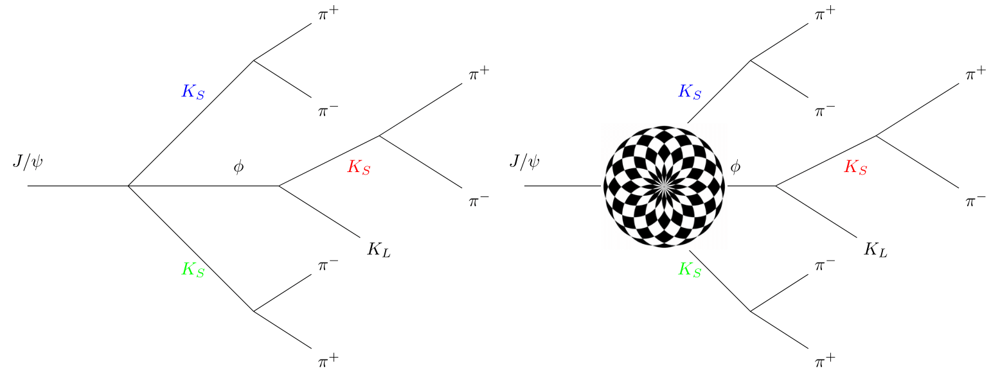

## What's `TopoAna`?
This is a tool to help the experimenters to analysis the background. Before fully understanding the typical analysis method,
I will instrduct some common knowledge to you.
### `Topo` 

The full spelling form is [topology](https://en.wikipedia.org/wiki/Topology). I will give you an example to feel the difficult for describe the decay of one particle.

Please look into the left figure, there are three `Ks` mesons in the decay
model. However, the three are not all same, the `Ks` with blue and green color
are identical, while the red one are a little different. In the analysis, we
must notice such case. Now, please look into the right figure, if we only look
into the final states `Ks`, i.e we want to know whether they are identical. 
Then we must look the mother of them, then to judge whether their mother are
identical ... It to be difficult to deal with.

Now, you may realize that we should develop a package to do such dirty work. 
Yes, then you find the repository, then look at this setense...
### data structure

In the following, I will instrduct a data structure to store the decay
information. You will say "Wow, It too simple!" or "Too fool!"
Please remember that each particle has one identify, i.e an integer. For
example, `J/psi` is `443`, `Ks` is `310`, `phi` is 333, `KL` is `130`..., then we can use one list or vector
to store all particles in the decay tree. (Yes, it just same as the tree in
`data structure`, one computer course.).
* This is the list we can obtain.
```c++
[334, 310, 310, 333, 130, 310, 211, -211, 211, -211, 211, -211]
```

A question should be raised is how to
know the position of each particle in the decay tree. Then we use another list
or vector to store the position of each particle. The tree root is tag as `-1`,
which is called as mother in the code. To know the position of other particles,
we only need to from who it decay. For example, `Ks` decay from `J/psi`, then 
we tag is as `0`, the index of `J/psi` in the first list. As well as the pion
which from `Ks`. 
* The following are the two list obtained from the example decay tree.

```c++
//0    1    2    3    4    5    6     7    8    9    10    11
[334, 310, 310, 333, 130, 310, 211, -211, 211, -211, 211, -211]
[ -1,  0,   0,   0,   3,    3,  5,    5,   1,    1,   2,    2]
```
It's the structure used in the program.
The following structure denote same tree, but it's seems very different from the
last one.
```c++
//0    1    2    3    4    5    6     7    8    9    10    11
[334, 310, 310, 333, 310, 130, 211, -211, 211, -211, 211, -211]
[ -1,  0,   0,   0,   3,    3,  1,    1,   2,    2,   4,    4]
```
The most hard task is
### How to judge two `trees` are same?

Fortunely, I solve this problem. That's all.

## How to use

### Install 

* copy it
```bash
git clone https://github.com/xxmawhu/DecayTopo.git
```
* compile it with `make`
## usage
In the directory `test`, you can find one example
```c++
#include "TCut.h"
using std::cout;
using std::endl;
void ana(){
    gSystem->Load("../lib/libtopology.so");
    // the tree name is "sig"
    Topology topo("mctruth");

    // a TCut could be set
    // for example TCut mcut = "mass > 100 && pT > 50";
    topo.SetCut("");
    topo.SetBranchName(
            "indexmc", 
            "pdgid", 
            "motheridx");
    // if more than one files should be analysised, 
    // please use "AddFiles" add them one by one
    topo.AddFiles("input.root");
    //topo.AddFiles("/scratc/sig.DpDm_dst_round04.root");
    topo.run();
}
```
